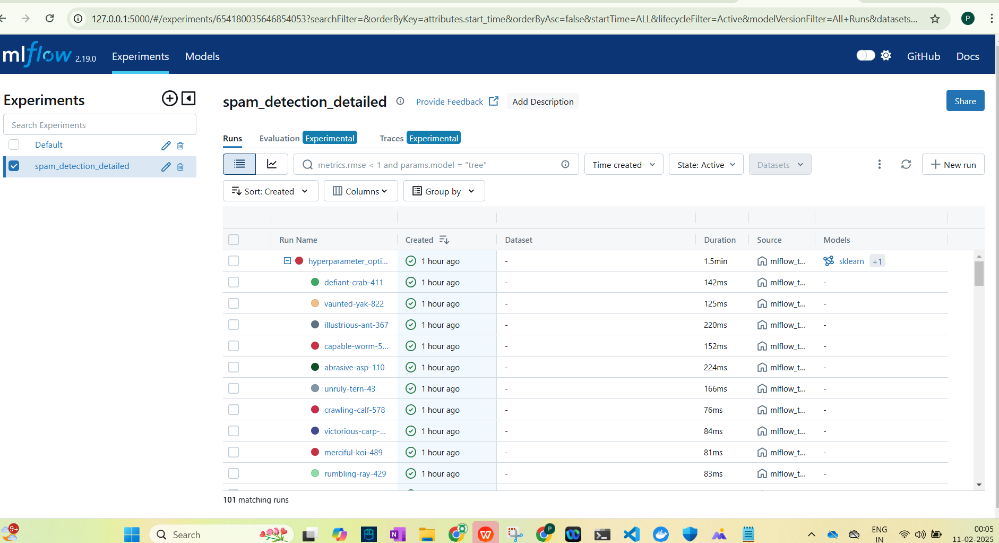

# StarTrek_MLOPS_Assignment
VNIT MTech MLOPS Subject Assignment : Mail SPM/HAM Detection POC

## To run the code add folder data/raw/spam_data.csv
Download spam_data.csv from follwing link `https://www.kaggle.com/datasets/thedevastator/sms-spam-collection-a-more-diverse-dataset`

## Project Overview

This project implements a spam detection system that uses Natural Language Processing (NLP) and machine learning techniques to classify text messages as spam or ham (non-spam). The system includes features like:

- Text preprocessing and feature engineering
- Class imbalance handling using SMOTE
- MLflow experiment tracking (run folder is inside src folder)
- Model optimization using RandomizedSearchCV
- Flask web interface for real-time predictions
- Docker containerization
- Support for continuous model updates with new data

## System Architecture

The project consists of several key components:

1. **Data Preprocessing** (`preprocess.py`)
   - Text cleaning and normalization
   - Stop word removal
   - Lemmatization
   - SMOTE for handling class imbalance

2. **Model Training** (`mlflow_training.py`, `model.py`)
   - TF-IDF vectorization
   - RandomForest classifier
   - Hyperparameter optimization
   - MLflow experiment tracking
   - Model evaluation metrics

3. **Web Application** (`app.py`)
   - Flask-based web interface
   - Real-time prediction endpoint
   - Automatic model updates with new data

## Prerequisites

- Python 3.13
- Required Python packages (specified in requirements.txt)
